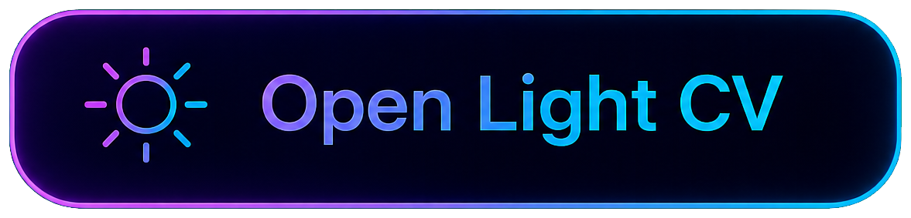
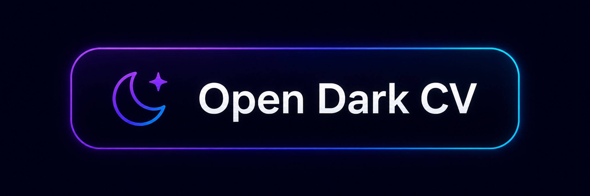

<p align="center">
  
</p>

<p align="center">
  <a href="./output/pdf/Lucian-Crainic-CV-light.pdf">
    
  </a>
  &nbsp;
  <a href="./output/pdf/Lucian-Crainic-CV-dark.pdf">
    
  </a>
</p>

# Curriculum Vitae

My professional curriculum vitae, available in light and dark themes.

## Build

Both PDFs are generated from the shared content in `src/cv-content.tex` using [Tectonic](https://tectonic-typesetting.github.io/):

```sh
make
```

The light entry point is `src/main.tex`, and the dark entry point is `src/main-dark.tex`. The final PDFs are written to `output/pdf/`; temporary LaTeX build files are not committed.
